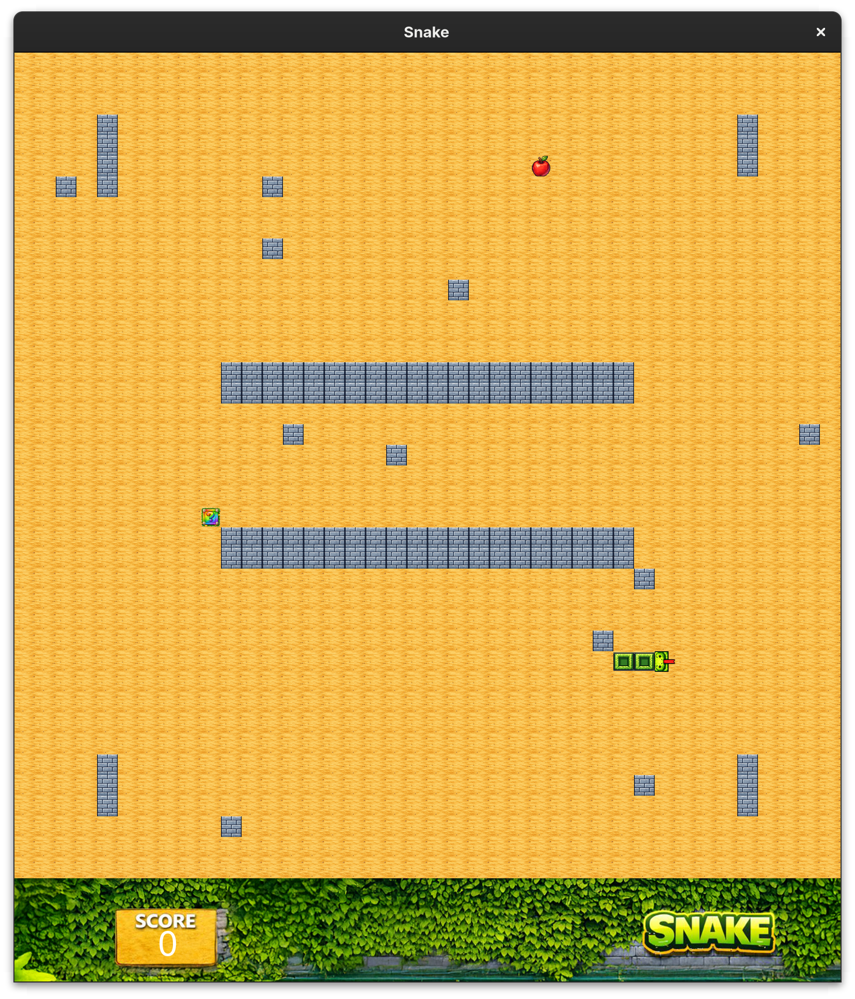

# SNAKE

Welcome to Snake. A little game made in Scala with the FunGraphics Library

## About the Project

## Getting Started
Welcome in the menu, in this interface, you can choose to play or to select the difficulty or the levels in the settingS.

## Features

1. Change difficulty
2. Change level
3. Mystery box with random bonus or malus (Lot of Food, Speed Boost, Fog, Halving the Snake, )
4. Speed increase with time
5. Infinite play
6. Score calculation

## Usage

Use the WASD key to change the direction of the Snake

## How It Works

## Contact

Antoine Auugsburger
Eren Sayinta

## License

Free to use. Enjoy !
